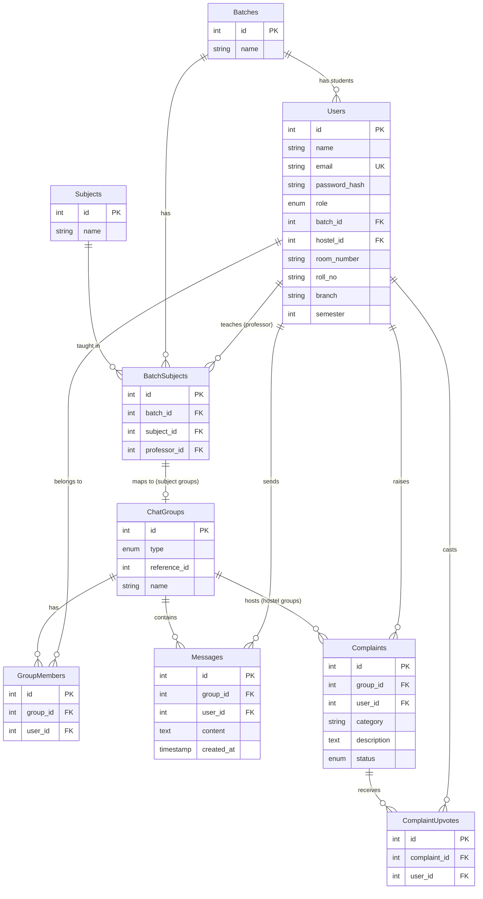

# CampusChat — BIT Mesra

A unified real-time messaging platform for university campuses — built to replace the scattered mess of WhatsApp groups, Gmail circulars, and separate portals with a single, role-aware app.

Professors get auto-created subject groups the moment they're assigned to a batch. Hostel groups double as a structured complaint-tracking system. A pinned announcements channel keeps DOSA/TnP notices in one place instead of buried in an inbox. Built solo, from scratch, as a full-stack learning project.

**Status:** Core platform is complete and fully functional. Gmail-sourced announcements (OAuth integration) are in progress. See [Roadmap](#-roadmap) below.

---

## ✨ Features

- **Role-based auth:** Students, professors, and admins, with JWT sessions and bcrypt-hashed passwords.
- **Auto-provisioned groups:** Signing up with a batch automatically adds a student to every subject group for that batch, based on real professor-subject-batch mappings (no manual setup).
- **Real-time chat:** Socket.io powered, with full message history persisted in MySQL (survives restarts).
- **Membership-gated rooms:** You can only join/read groups you're actually a member of, enforced server-side on every request.
- **Pinned announcements channel:** Read-only for students, post-only for professors/admins, visually distinct in the UI.
- **Hostel groups with structured complaints:** Category, status (open/in-progress/resolved), and duplicate-safe upvoting.
- **1:1 direct messages:** Created on-demand the first time two users message each other, with duplicate protection.
- **Ad-hoc group creation:** Any student can start a custom group and invite others, WhatsApp-style.
- **Group info panel:** View members, click any member to start a DM.
- **Editable student profile:** Roll no, branch, semester, hostel, room number; setting or updating a hostel auto-joins that hostel's group and leaves the previous one.
- **Portal quick-links:** ERP, TnP, syllabus, PYQs, timetable, all one click away.
- **Theme toggle:** Dark / light theme toggle.

---

## 🏗️ Tech Stack

| Layer | Tech |
|---|---|
| **Backend** | Node.js, Express |
| **Real-time** | Socket.io |
| **Database** | MySQL (via `mysql2`) |
| **Auth** | JWT (`jsonwebtoken`) + bcrypt |
| **Frontend** | Vanilla JS, HTML, CSS (no framework) |
| **Icons** | [Lucide](https://lucide.dev/) |

* **Why MySQL over MongoDB:** The data is fundamentally relational — a user has one batch, a batch has many subject groups, a group has many members, a message belongs to exactly one group and one sender. Foreign keys let the database itself enforce "this message must belong to a real group" rather than relying on application code to catch every edge case.
* **Why JWT:** Stateless auth means the server doesn't need to track sessions in memory or a session store — each request carries its own signed proof of identity, which also made it straightforward to authenticate Socket.io connections the same way as REST routes.

---

## 🗂️ Database Schema

9 tables, designed around one core idea: almost everything is a `ChatGroups` row with a type (subject, hostel, dm, announcement, or custom) — new group kinds are added by extending an enum, not by adding new tables.



### Notable design choices:
* `ChatGroups.reference_id` is a polymorphic reference (points to `BatchSubjects.id` for subject groups, or `Hostels.id` for hostel groups; it is `NULL` for dm/announcement/custom groups).
* Composite `UNIQUE (group_id, user_id)` on `GroupMembers` and `UNIQUE (complaint_id, user_id)` on `ComplaintUpvotes` prevent duplicate memberships and duplicate upvotes at the database level.
* DMs are created lazily (first message between two users) and resolved using a query that ensures a `ChatGroups` row has exactly two members matching both user IDs.

---

## 🚀 Setup

### Prerequisites
* Node.js 18+
* MySQL Server (local or hosted)

### 1. Clone and install
```bash
git clone https://github.com/AmitRauniyarr/campus_chat.git
cd campus_chat
npm install
```

### 2. Environment variables
Create a `.env` file in the project root based on `.env.example`:
```env
DB_HOST=localhost
DB_USER=your_mysql_username
DB_PASSWORD=your_mysql_password
DB_NAME=campus_chat
JWT_SECRET=your_long_random_secret_here
PORT=3001
```

### 3. Database Setup
Create a local MySQL database named `campus_chat` and load the schema from [campus_chat_railway.sql](file:///c:/chat%20project/campus_chat_railway.sql):
```bash
mysql -u your_mysql_username -p -e "CREATE DATABASE campus_chat;"
mysql -u your_mysql_username -p campus_chat < campus_chat_railway.sql
```

### 4. Seed demo data
1. Start the server in one terminal:
   ```bash
   npm start
   ```
2. In another terminal, seed the database with demo accounts, groups, messages, and hostel structures:
   ```bash
   node seed.js
   ```
   *All seeded accounts use the password `Campus@123`.*
   *DOSA/Admin login: `dosa@bitmesra.ac.in`.*

### 5. Run the Application
Start the development server with:
```bash
npm run dev
```
Visit http://localhost:3001 in your browser.

---

## 📡 API Overview

| Method | Route | Purpose |
|---|---|---|
| **POST** | `/auth/signup` | Create account (auto-provisions subject groups if a student) |
| **POST** | `/auth/login` | Log in and receive a JWT token |
| **GET** | `/auth/me` | Retrieve current user's profile details |
| **PATCH** | `/auth/me` | Update profile (auto-joins/leaves hostel group if `hostel_id` is updated) |
| **PUT** | `/auth/profile` | Update profile (alias of `PATCH /auth/me`) |
| **GET** | `/group/my-groups` | List the caller's groups (resolves DM names dynamically per-viewer) |
| **POST** | `/group/create` | Create an ad-hoc custom group with selected members |
| **GET** | `/group/:id/messages` | Retrieve message history for a group (membership-gated) |
| **GET** | `/group/:id/members` | Retrieve member list for a group |
| **GET** | `/users/search?q=` | Search users by name (for DMs or custom groups) |
| **POST** | `/dms/start/:otherUserId` | Get-or-create a DM room with another user |
| **POST** | `/complaints` | Raise a complaint in a hostel group |
| **GET** | `/complaints/:groupId` | List complaints for a hostel group, ordered by upvotes |
| **POST** | `/complaints/:id/upvote` | Upvote a complaint (duplicate-safe) |

### Socket.io Events:
* **Client to Server:** `join_room` (groupId), `client_hello` (sends `{ groupId, message }`)
* **Server to Client:** `message_history` (preloaded messages), `new_message` (incoming messages), `join_error`, `permission_error`

---

## 🗺️ Roadmap

- [ ] **Gmail OAuth integration** — surface DOSA/ADOSA circulars from a connected Gmail account directly into the announcements channel
- [ ] **File/image sharing** — share images/documents in chat (with a proper storage backend)
- [ ] **Admin panel** — managing batches, subjects, and hostels without direct SQL
- [ ] **Chat enhancements** — message read receipts and typing indicators
- [ ] **Deployment** — automated build pipeline for backend, hosted MySQL, and frontend

---

## 🙋 About

Built with ❤️ by **Amit Rauniyar**, a BTech ECE student at **BIT Mesra**, as a hands-on project to master full-stack development — from raw WebSocket fundamentals to relational schema design, role-based auth, and real-time event loops — while solving a real, everyday communication problem on campus.
